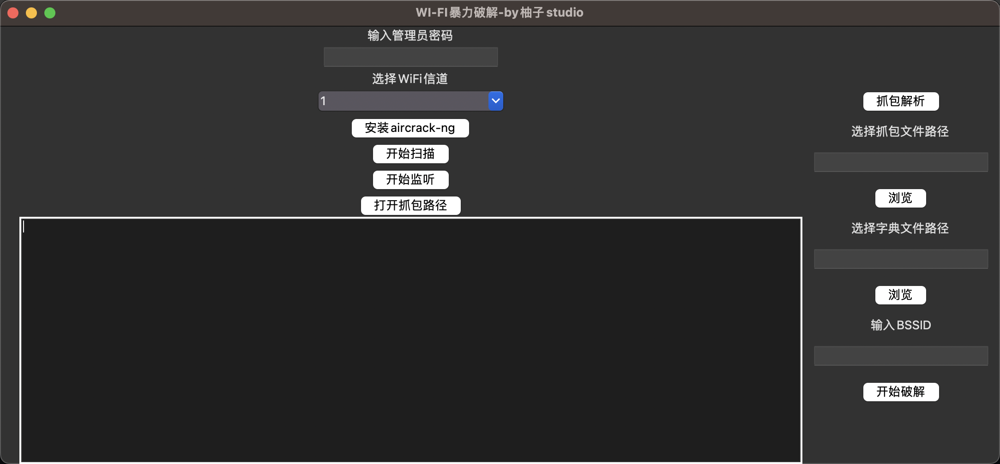

# Aircrack-ng GUI for macOS

## 简介

`aircrack-ng_gui_macos` 是一个用于 macOS 的 Wi-Fi 密码暴力破解器。本工具基于著名的 [Aircrack-ng](https://www.aircrack-ng.org/) 套件，并提供了一个图形用户界面（GUI）以简化操作。

## 功能

- 支持多种加密标准（WEP, WPA, WPA2）
- 用户友好的图形界面

## 安装

mac用户可直接下载[主程序压缩包](main.zip)
解压后直接打开即可

## 使用方法

1. 打开应用程序。
2. 选择目标网络。
3. 点击 “开始破解” 按钮。
。

## 截图

## 许可

本项目基于 GPLV3 许可证。详情请查看 [LICENSE](LICENSE) 文件。
